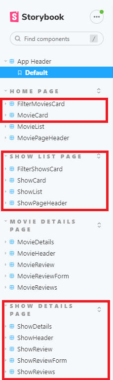
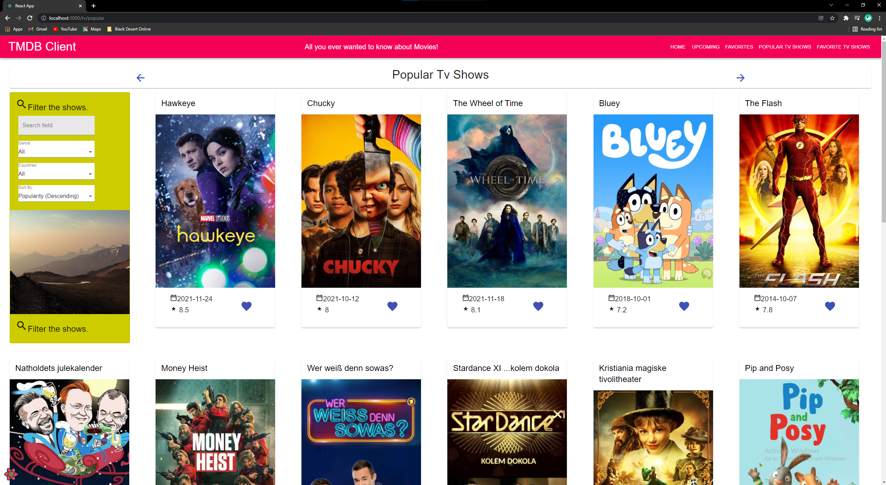
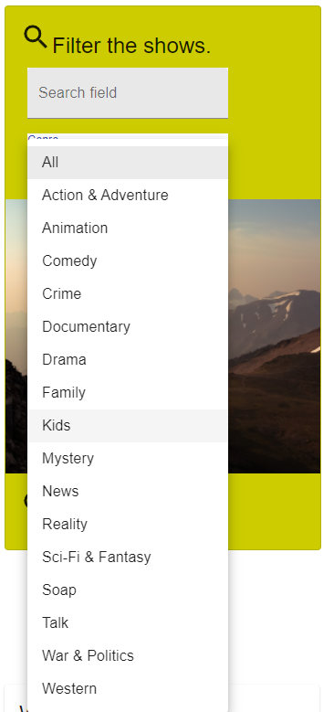
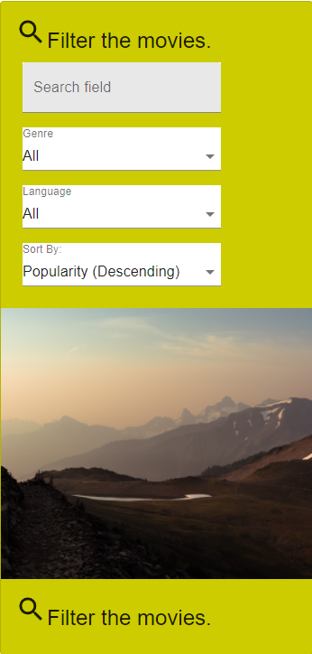
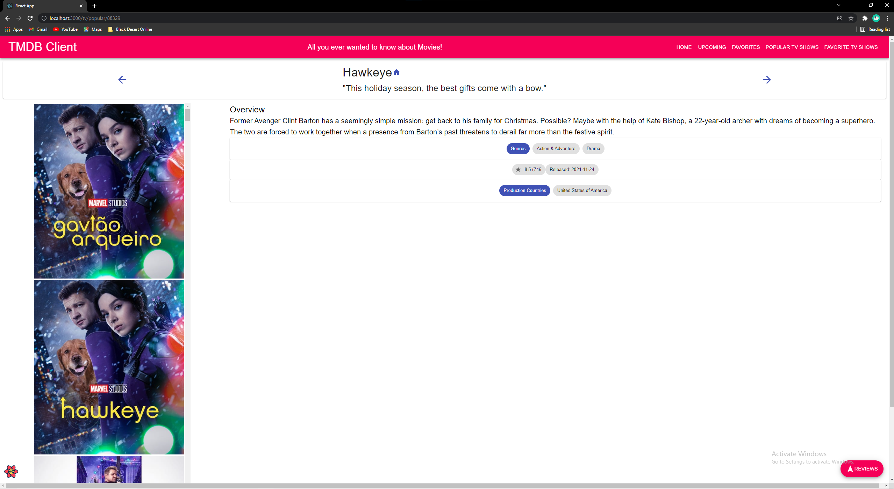
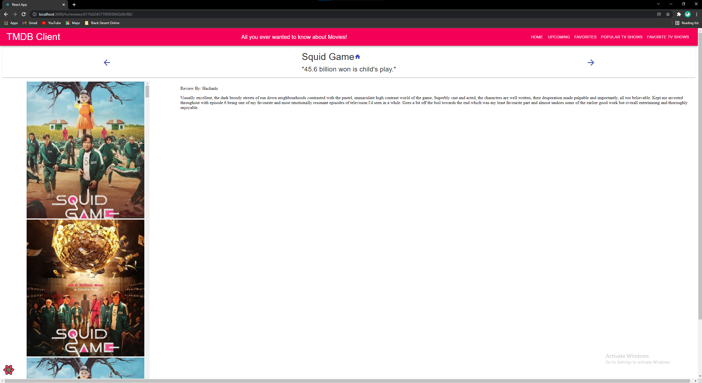
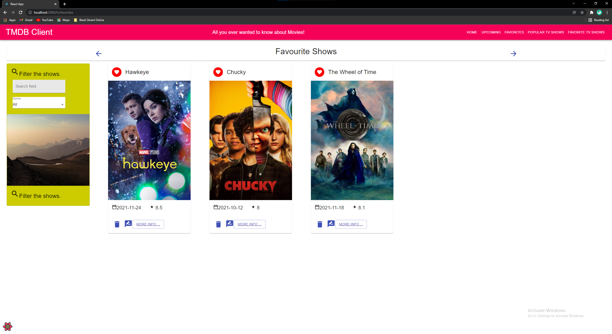
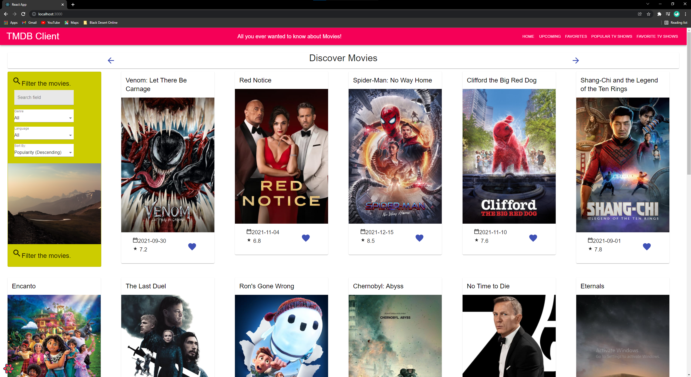
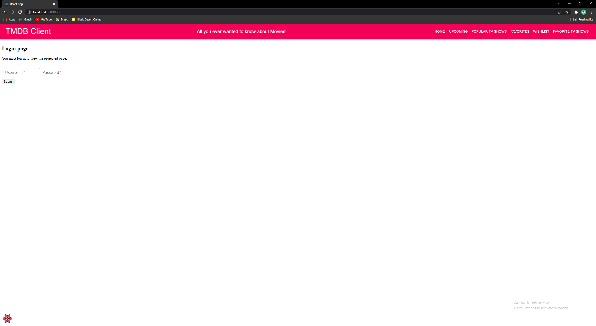

# Assignment 1 - ReactJS app.

Name: Jakub Poczatek

## Overview.

Movie app powered by React. 
The movie app allows the user to do the following things:

Discover Movies
================
View the current popular movies, filter the movies by name, genre & original language of the movie and sort the movies by ascending and descending orders of popularity, alphabetical & average rating. 

View the details of each movie in the movie list by pressing the title, this takes the user to a new page.

On the movie page, the user can:
    Access the movies homepage by pressing on the house icon beside the name
    View a list of reviews as well as a full review page for each review

On the movie list page the user can also add the movie to a list of favorite movies by pressing the blue heart icon, 
this displays a red icon beside to name to show that the movie has been added.

On the favorites page, the user can:
    Filter the favorite movies
    Remove the movies from favorites by pressing the trash can icon
    Leave a review by pressing the message icon, this will take the user to a new page, this page is protected by an authentication feature. 
    Access the movie details page

On the review form page, the user can fill out fields as requested, once submitted the user will be notified of the review submission, 
the review will not be stored. 

Upcoming Movies
================
The Upcoming movies page shares all of its functionality with the discover movies, it allows the user to:
    View the upcoming movies and filter them by name, genre & country of origin. The user can also sort the movies by ascending and descending orders of popularity, alphabetical and average rating.
    View the details of each show
        Same functionality as movie page.
    Add to a wishlist of upcoming movies
        Same behaviour as movie favorite page, except for the lack of a leave review button as it wouldn't make sense to leave a review on a movie that's unreleased. 

Popular Tv Shows
=================
The Popular Tv Shows page shares all of its funtionality with the discover movies page, it allows the user to:
    View the current popular tv shows and filter them by name, genre & country of origin. The user can also sort the shows by ascending and descending orders of popularity, alphabetical and average rating.
    View the details of each show 
        Access the homepage of each show
        view a list of reviews as well as a full review 
    Add to a list of favorite shows 
        Same behaviour as movie favorite page

### Features.

+ Popular Tv Shows page (using new endpoint)
+ Show Details page (using 2 new endpoint (show details & show images))
+ Filter the shows by show genres (using new endpoint). Filter the shows by name and country of origin.
+ Sort the shows by popularity, alphabetical and average ratings. 
+ Show favorites page
+ Show reviews and full review page (using new endpoint)
+ Show review form page
+ Upcoming Movies page (using new endpoint)
+ Wishlist to show *favorited* upcoming movies 
+ Parameterized urls for each route
+ Change useQuery statements in existing files to specify movie relevant information ("images" => "movieImages") and added useQuery to relevant show pages
+ Changed the link for move/show details from a "ShowMore..." button to a hyperlinked title. 
+ Changed the movie filter card to allow extra filtering based on original language and sorting based on popularity, alphabetical & average ratings. 
+ Added an authentication layer to movie and show review forms.

## Setup requirements.

React App
==========
1. Unzip the file into a folder.
2. Open the "wad2-moviesApp-master" folder with your chosen file editor.
3. Open a new terminal and inside the "wad2-moviesApp-master" run the command -> 'npm install'.
4. Start the react app by running the command -> 'npm start'. This will open a new tab in your default browser.
5. Enjoy!.

Storybook Components
=====================
After following the steps above up to and including step 4. Run the command 'npm run storybook'. This will open a new tab in your default browser where you can view components. 

## API endpoints.

+ Popular tv shows - tv/popular
+ Show details - tv/:id
+ Show images - tv/:id/images
+ Show reviews - tv/:id/reviews
+ Show genres - genre/tv/list
+ List of Languages - configuration/languages
+ List of Countries - configuration/countries 

## App Design.

### Component catalogue.

### UI Design.

>Shows a list of currently popular tv shows, a user can check movie details, add to favorites and filter by genre.

>Uses specific name, genres & country to filter shows. Allows for sorting based on popularity, alphabetical & average rating.

>Uses specific name, genres & language to filter movies. Allows for sorting based on popularity, alphabetical & average rating.

>Shows detailed information on a show. Clicking the house icon will take the user to the shows home page and clicking the "Reviews" floating action button will display extracts from critic reviews.

>Clicking the "Full Review" link in the reivew extracts will take the user to a page displaying the full review.

>Displays a list of the users favorites shows. Allows the user to delete a show from their list of favorites and to leave a review on the show.

>Allows the user to fill out required fields to leave a review on the show, the review doesn't get stored.

>Changed "MoreInfo..." button to a hyperlinked title button

>User needs to enter an existing user to access the review page, if incorrect username and password are entered, nothing will happen. 

### Routing.

[ List the __new routes__ supported by your app and state the associated page.]

+ /tv/favorites - displays the users favorite shows
+ /tv/popular/:id - displays the details on a show
+ /tv/popular - displays list of shows
+ /tv/reviews/:id  - displays a full page version of a show review 
+ /tv/reviews/form - displays a full page web form to leave a review on a show (private route)
+ /reviews/form - displays a full page web form to leave a review on a movie (private route)
+ /login - login page for authentication

[If relevant, state what aspects of your app are protected (i.e. require authentication) and what is public.]

## Independent learning (If relevant).

[ Itemize the technologies/techniques you researched independently and adopted in your project, i.e. aspects not covered in the lectures/labs. Include the source code filenames that illustrate these (we do not require code excerpts) and provide references to the online resources that helped you (articles/blogs).
