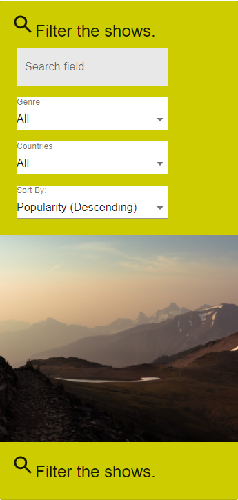

# Assignment 1 - ReactJS app.

Name: Jakub Poczatek

## Overview.

Movie app powered by React. 
The movie app allows the user to do the following things:

Discover Movies
================
View the current popular movies and filter them by genre.

View the details of each movie in the movie list by pressing "More Info...", this takes the user to a new page.

On the movie page, the user can:
    Access the movies homepage by pressing on the house icon beside the name
    View a list of reviews as well as a full review page for each review

On the movie list page the user can also add the movie to a list of favorite movies by pressing the blue heart icon, 
this displays a red icon beside to name to show that the movie has been added.

On the favorites page, the user can:
    Filter the favorite movies
    Remove the movies from favorites by pressing the trash can icon
    Leave a review by pressing the message icon, this will take the user to a new page
    Access the movie details page

On the review form page, the user can fill out fields as requested, once submitted the user will be notified of the review submission, 
the review will not be stored. 

Upcoming Movies
================
The upcoming movies page allows the user to do the same funtionality (relative to upcoming movies) as the discover movies page. 
The only feature difference being the substitute of the add to favorites ability for an add to wishlist button, this button doesn't perform any actions. 

Popular Tv Shows
=================
The Popular Tv Shows page shares all of its funtionality with the discover movies page, it allows the user to:
    View the current popular tv shows and filter them by genre 
    View the details of each show 
        Access the homepage of each show
        view a list of reviews as well as a full review 
    Add to a list of favorite shows 
        Same behaviour as movie favorite page

### Features.

+ Popular Tv Shows page (using new endpoint)
+ Show Details page (using 2 new endpoint (show details & show images))
+ Filter the shows by show genres (using new endpoint)
+ Show favorites page
+ Show reviews and full review page (using new endpoint)
+ Show review form page
+ Parameterized urls for each route
+ Change useQuery statements in existing files to specify movie relevant information ("images" => "movieImages") and added useQuery to relevant show pages

## Setup requirements.

[ Outline any non-standard setup steps necessary to run your app locally after cloning the repo.]

## API endpoints.

+ Popular tv shows - tv/popular
+ Show details - tv/:id
+ Show images - tv/:id/images
+ Show reviews - tv/:id/reviews
+ Show genres - genre/tv/list

## App Design.

### Component catalogue.

[ Insert a screenshot from the Storybook UI that lists all the stories for the app's components, and highlight those relating to your __new/modified components__ - see the example screenshot below.] .......

### UI Design.

>Shows a list of currently popular tv shows, a user can check movie details, add to favorites and filter by genre.

>Uses specific show genres to filter shows

>Shows detailed information on a show. Clicking the house icon will take the user to the shows home page and clicking the "Reviews" floating action button will display extracts from critic reviews.

>Clicking the "Full Review" link in the reivew extracts will take the user to a page displaying the full review.

>Displays a list of the users favorites shows. Allows the user to delete a show from their list of favorites and to leave a review on the show.

>Allows the user to fill out required fields to leave a review on the show, the review doesn't get stored.

### Routing.

[ List the __new routes__ supported by your app and state the associated page.]

+ /tv/favorites - displays the users favorite shows
+ /tv/popular/:id - displays the details on a show
+ /tv/popular - displays list of shows
+ /tv/reviews/:id  - displays a full page version of a show review 
+ /tv/reviews/form - displays a full page web form to leave a review on a show

[If relevant, state what aspects of your app are protected (i.e. require authentication) and what is public.]

## Independent learning (If relevant).

[ Itemize the technologies/techniques you researched independently and adopted in your project, i.e. aspects not covered in the lectures/labs. Include the source code filenames that illustrate these (we do not require code excerpts) and provide references to the online resources that helped you (articles/blogs).
